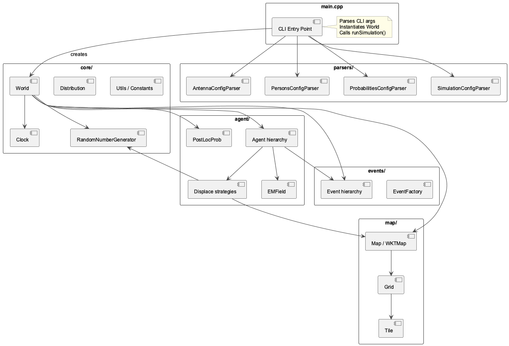
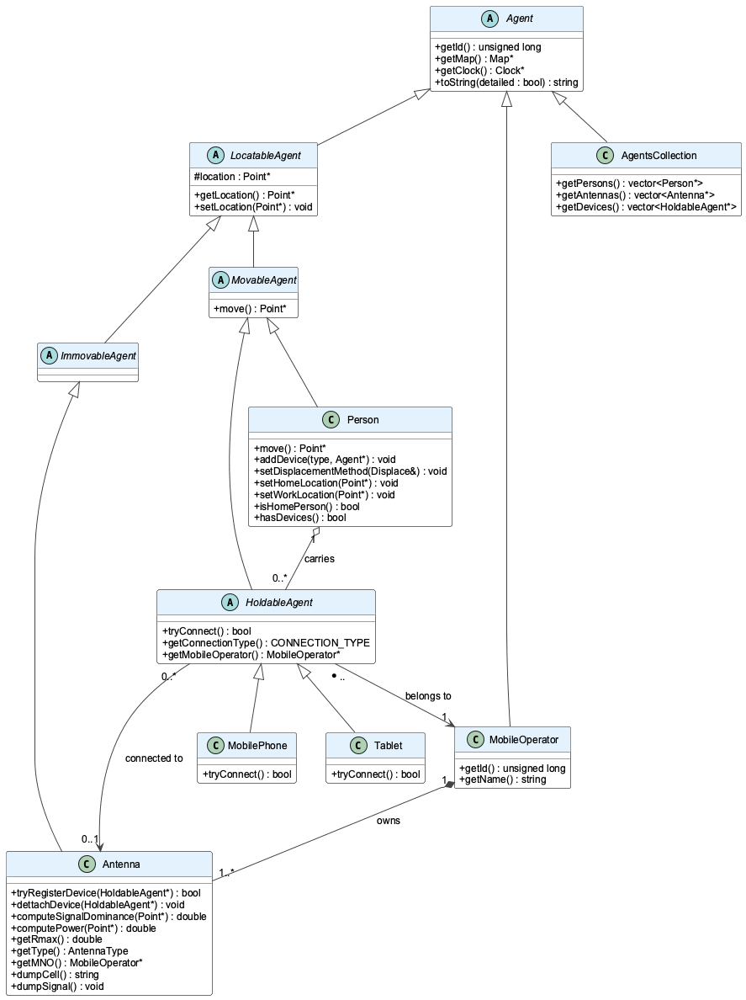
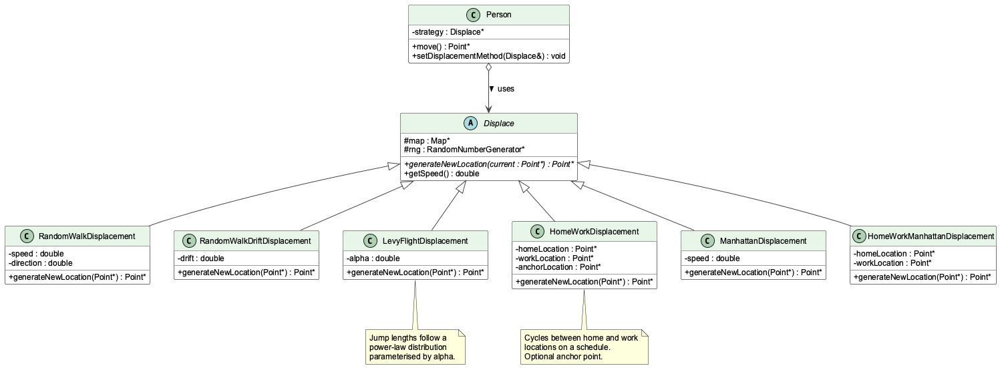
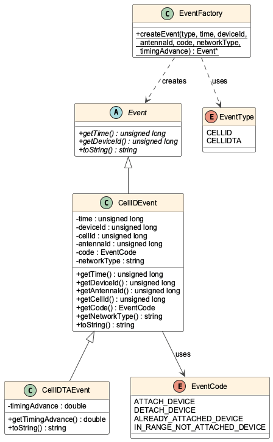
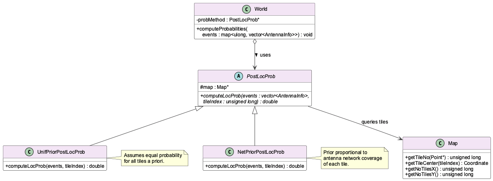
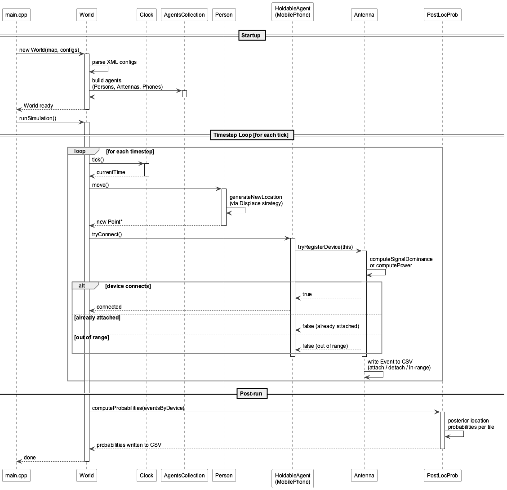

# NetEventSimulator – Architecture & API Reference

This document describes the software architecture of NetEventSimulator using UML-style diagrams and module-level API descriptions. It is a companion to the [README](README.md) and the auto-generated Doxygen reference.

UML diagrams are available as PNG and EPS in the [`diagrams/`](diagrams/) directory. PlantUML source files (`.puml`) are included so diagrams can be regenerated with `plantuml -tpng diagrams/*.puml`.

---

## 1. Module Map

The codebase is split into five modules. Arrows show compile-time dependencies (→ = "depends on").



```
┌──────────────────────────────────────────────────────────────────┐
│                            main.cpp                              │
│  Parses CLI args → instantiates World → calls runSimulation()    │
└────────────────────────────┬─────────────────────────────────────┘
                             │
                             ▼
┌─────────────────────────────────────────────────────────────────────────────┐
│                              core/                                          │
│  World · Clock · RandomNumberGenerator · Distribution · Constants · Utils  │
└──────┬──────────────┬──────────────┬────────────────┬──────────────────────┘
       │              │              │                │
       ▼              ▼              ▼                ▼
┌────────────┐ ┌────────────┐ ┌──────────────┐ ┌──────────────────┐
│  agent/    │ │   map/     │ │   events/    │ │   parsers/       │
│            │ │            │ │              │ │                  │
│ Agent      │ │ Map        │ │ Event        │ │ SimulationConfig │
│ Person     │ │ WKTMap     │ │ CellIDEvent  │ │ AntennaConfig    │
│ Antenna    │ │ Grid       │ │ CellIDTA-    │ │ PersonsConfig    │
│ MobilePhone│ │ Tile       │ │   Event      │ │ Probabilities-   │
│ MobileOp-  │ │            │ │ EventFactory │ │   Config         │
│   erator   │ │            │ │ EventType    │ │                  │
│ Displace   │ │            │ │ EventCode    │ │                  │
│  (6 strats)│ │            │ │              │ │                  │
│ EMField    │ │            │ │              │ │                  │
│ PostLocProb│ │            │ │              │ │                  │
└────────────┘ └────────────┘ └──────────────┘ └──────────────────┘
```

---

## 2. Agent Class Hierarchy



```
Agent  (abstract)
├── LocatableAgent  (abstract – has a Point* location)
│   ├── ImmovableAgent  (abstract – fixed location)
│   │   └── Antenna
│   └── MovableAgent  (abstract – location changes each tick)
│       ├── Person
│       └── HoldableAgent  (abstract – owned by a Person)
│           ├── MobilePhone
│           └── Tablet
├── MobileOperator
└── AgentsCollection
```

### Key relationships

| Relationship | Description |
|---|---|
| `Person` 1 ──> * `HoldableAgent` | A person carries zero or more devices |
| `HoldableAgent` * ──> 1 `MobileOperator` | Every device belongs to one operator |
| `MobileOperator` 1 ──> * `Antenna` | An operator owns one or more antennas |
| `HoldableAgent` * ──> 0..1 `Antenna` | A device is connected to at most one antenna |
| `Antenna` 1 ──> 1 `EMField` | Signal coverage is computed by EMField |

---

## 3. Displacement Strategy Pattern

Movement algorithms are encapsulated behind the `Displace` interface and injected into `Person` at construction time.



```
          «interface»
          Displace
          ─────────────────────────────────
          + generateNewLocation(Point*) : Point*
          + getSpeed() : double
               ▲
               │ (inherits)
    ┌──────────┬──────────┬───────────┬────────────────────┬──────────────────────────┐
    │          │          │           │                    │                          │
RandomWalk  RandomWalk  LevyFlight  HomeWork           Manhattan        HomeWorkManhattan
Displacement  Drift      Displacement Displacement     Displacement      Displacement
            Displacement
```

### Strategies at a glance

| Class | Movement model | Key parameters |
|---|---|---|
| `RandomWalkDisplacement` | Uniform random bearing; bounces off map boundary | `speed`, `direction` |
| `RandomWalkDriftDisplacement` | Random walk with a fixed directional bias | `drift` angle |
| `LevyFlightDisplacement` | Power-law jump length distribution | `alpha` (stability index) |
| `HomeWorkDisplacement` | Cycles between home/work on a schedule | `homeLocation`, `workLocation`, `anchorLocation` |
| `ManhattanDisplacement` | Axis-aligned grid movement | `speed` |
| `HomeWorkManhattanDisplacement` | Home/work cycle along grid streets | same as HomeWork + Manhattan |

---

## 4. Event System



```
«enumeration»           «enumeration»
EventType               EventCode
──────────              ──────────────────────────────
CELLID                  ATTACH_DEVICE
CELLIDTA                DETACH_DEVICE
                        ALREADY_ATTACHED_DEVICE
                        IN_RANGE_NOT_ATTACHED_DEVICE

        «interface»
        Event
        ─────────────────────────────────────────────────
        + getTime() : unsigned long
        + getDeviceId() : unsigned long
        + toString() : string
               ▲
        ┌──────┴───────────────┐
   CellIDEvent            CellIDTAEvent
   ──────────────          ──────────────────────
   time                    time
   deviceId                deviceId
   cellId                  cellId
   antennaId               antennaId
   code : EventCode        code : EventCode
   networkType             networkType
                           timingAdvance : double

«factory»
EventFactory
──────────────────────────────────────────
+ static createEvent(EventType, ...) : Event*
```

Events are written per-antenna to CSV output files. Each `Antenna` owns its output file; the file name is returned by `Antenna::getAntennaOutputFileName()`.

---

## 5. Probability Layer



```
«interface»
PostLocProb
─────────────────────────────────────────────────────
+ computeLocProb(events, tileIndex) : double
          ▲
    ┌─────┴──────────────────────┐
UnifPriorPostLocProb       NetPriorPostLocProb
(uniform tile prior)       (network-coverage prior)
```

Probability computation is triggered from `World::computeProbabilities()` after all agents have moved and events have been collected.

---

## 6. Simulation Lifecycle (Sequence Diagram)



```
main.cpp          World              Clock        AgentsCollection    Antenna    PostLocProb
   │                │                  │                 │               │            │
   │─ new World() ─▶│                  │                 │               │            │
   │                │─ parse configs ─▶│                 │               │            │
   │                │─ build agents ──────────────────▶ │               │            │
   │                │                  │                 │               │            │
   │─ runSimulation()▶                 │                 │               │            │
   │                │                  │                 │               │            │
   │                │◀── tick() ───────│                 │               │            │
   │                │    [for each timestep]             │               │            │
   │                │                  │                 │               │            │
   │                │────── move() ──────────────────▶  │               │            │
   │                │       [each Person]                │               │            │
   │                │                  │                 │               │            │
   │                │────── tryConnect() ────────────────────────────▶  │            │
   │                │       [each HoldableAgent]         │               │            │
   │                │                  │                 │               │            │
   │                │◀────────────────────── Event ──────│               │            │
   │                │                  │  (attach/detach/in-range)       │            │
   │                │                  │                 │               │            │
   │                │  [end of loop]   │                 │               │            │
   │                │                  │                 │               │            │
   │                │─── computeProbabilities() ─────────────────────────────────▶  │
   │                │                  │                 │               │            │
   │◀─ done ────────│                  │                 │               │            │
```

---

## 7. Module API Reference

### 7.1 `World`

Central orchestrator. Created once by `main.cpp`; owns all simulation state.

```cpp
World(Map* map,
      const string& personsConfigFile,
      const string& antennasConfigFile,
      const string& simulationConfigFile,
      const string& probabilitiesConfigFile);

void runSimulation();

// Accessors
AgentsCollection*  getAgents();
const Map*         getMap();
Clock*             getClock();

// Post-run probability layer
map<unsigned long, vector<AntennaInfo>>
    getEvents(bool computeProbabilities);

void computeProbabilities(
    map<unsigned long, vector<AntennaInfo>> eventsByDevice);
```

### 7.2 `Clock`

Discrete-time counter shared by all agents.

```cpp
Clock(unsigned long startTime,
      unsigned long endTime,
      unsigned long increment);

unsigned long tick();               // advance one step; returns new time
unsigned long getInitialTime();
unsigned long getCurrentTime();
unsigned long getFinalTime();
unsigned long getIncrement();
unsigned long getNTimeSteps();      // total number of ticks
```

### 7.3 `Map` / `WKTMap`

Abstract spatial container. `WKTMap` reads the boundary polygon from a WKT file.

```cpp
// Construction (WKTMap)
WKTMap(const string& wktFile);

// Spatial queries
geos::geom::Geometry* getBoundary();
geos::geom::Geometry* getEnvelope();
bool                  contains(geos::geom::Point*);

// Grid overlay (call once before simulation)
void addGrid(double tileDimX, double tileDimY);

// Tile lookup
unsigned long getTileNo(geos::geom::Point*);
unsigned long getTileNo(double x, double y);
geos::geom::Coordinate getTileCenter(unsigned long tileIndex);

// Tile dimensions
unsigned long getNoTilesX();
unsigned long getNoTilesY();
double        getXTileDim();
double        getYTileDim();

void dumpGrid(const string& outputFile);   // write tile parameters to CSV
```

### 7.4 `Agent` / `Person`

```cpp
// Agent (base)
unsigned long getId();
const Map*    getMap();
Clock*        getClock();
string        toString(bool detailed = false);

// Person
geos::geom::Point* move();              // one step; updates internal position
void setLocation(geos::geom::Point*);  // also propagates to held devices
void addDevice(const string& type, Agent* device);
void setDisplacementMethod(shared_ptr<Displace>& strategy);

void setHomeLocation(geos::geom::Point*);
void setWorkLocation(geos::geom::Point*);
void setAnchorLocation(geos::geom::Point*);

bool isHomePerson();    // true when person is at home location
bool hasDevices();
```

### 7.5 `Antenna`

```cpp
// Connection management
bool tryRegisterDevice(HoldableAgent*);   // returns true on success
void dettachDevice(HoldableAgent*);

// Signal model
AntennaType getType();                    // OMNIDIRECTIONAL | DIRECTIONAL
double getRmax();                         // maximum coverage radius (metres)
double computeSignalDominance(geos::geom::Point*);
double computePower(geos::geom::Point*);

// Ownership
MobileOperator* getMNO();

// Output
string getAntennaOutputFileName();
string dumpCell();          // WKT polygon of coverage area
void   dumpSignal();        // signal strength/dominance grid to file
```

### 7.6 `HoldableAgent` / `MobilePhone`

```cpp
// Connection
bool tryConnect();                        // finds and connects to best antenna
CONNECTION_TYPE getConnectionType();      // USING_POWER | USING_SIGNAL_DOMINANCE
                                          //   | USING_SIGNAL_STRENGTH | UNKNOWN

const MobileOperator* getMobileOperator();
```

### 7.7 `Displace` (strategy interface)

```cpp
virtual geos::geom::Point*
    generateNewLocation(geos::geom::Point* current) = 0;

double getSpeed();
```

### 7.8 `Event` / `CellIDEvent` / `CellIDTAEvent`

```cpp
// Event (abstract)
unsigned long getTime();
unsigned long getDeviceId();
virtual string toString() = 0;

// CellIDEvent adds
unsigned long getAntennaId();
unsigned long getCellId();
EventCode     getCode();        // ATTACH_DEVICE | DETACH_DEVICE | …
string        getNetworkType();

// CellIDTAEvent adds
double getTimingAdvance();      // distance proxy (used in 3G/4G)
```

### 7.9 `EventFactory`

```cpp
static Event* createEvent(EventType type,
                          unsigned long time,
                          unsigned long deviceId,
                          unsigned long antennaId,
                          EventCode     code,
                          const string& networkType,
                          /* optional */ double timingAdvance = 0.0);
```

### 7.10 Configuration parsers

Each parser reads an XML file and exposes a typed configuration object.

| Parser class | Config class | Root element |
|---|---|---|
| `SimulationConfigurationParser` | `SimulationConfiguration` | `<simulation>` |
| `AntennaConfigParser` | `AntennaConfiguration` | `<antennas>` |
| `PersonsConfigParser` | `PersonConfiguration` | `<persons>` |
| `ProbabilitiesConfigParser` | `ProbabilitiesConfiguration` | `<probabilities>` |

All parsers follow the same construction pattern:

```cpp
FooConfigParser parser(filePath);
FooConfiguration config = parser.parse();
```

---

## 8. Key Enumerations

```cpp
// Movement strategy selector (SimulationConfiguration)
enum MovementType {
    RANDOM_WALK_CLOSED_MAP,
    RANDOM_WALK_CLOSED_MAP_WITH_DRIFT,
    LEVY_FLIGHT,
    HOME_WORK,
    MANHATTAN,
    HOME_WORK_MANHATTAN
};

// Antenna radiation pattern
enum AntennaType {
    OMNIDIRECTIONAL,   // circular coverage; uses Rmax only
    DIRECTIONAL        // sector coverage; uses azimuth, elevation, beamwidths
};

// Event semantics
enum EventCode {
    ATTACH_DEVICE,
    DETACH_DEVICE,
    ALREADY_ATTACHED_DEVICE,
    IN_RANGE_NOT_ATTACHED_DEVICE
};

// Event record format
enum EventType {
    CELLID,     // timestamp + cell ID only
    CELLIDTA    // adds timing-advance distance estimate
};

// How a device selects its serving antenna
enum CONNECTION_TYPE {
    USING_POWER,
    USING_SIGNAL_DOMINANCE,
    USING_SIGNAL_STRENGTH,
    UNKNOWN
};
```

---

## 9. Output Files

| File pattern | Content | Trigger |
|---|---|---|
| `<antenna_id>.csv` | Per-antenna event log (time, deviceId, cellId, code, …) | Each attach/detach/in-range event |
| `grid.csv` | Tile coordinates and dimensions | `Map::dumpGrid()` |
| `signal_<antenna_id>.csv` | Signal strength/dominance on the tile grid | `Antenna::dumpSignal()` |
| `cells.wkt` | WKT polygons of antenna coverage areas | `Antenna::dumpCell()` |
| `probabilities_<tileId>.csv` | Posterior location probabilities per tile | `World::computeProbabilities()` |

---

## 10. External Dependencies

| Library | Role | Version |
|---|---|---|
| **GEOS** | All geometry: points, polygons, spatial predicates | 3.10.7 (max tested) |
| **TinyXML2** | XML configuration parsing | embedded |
| **csv.h** | Header-only CSV parser | embedded |
| **tnorm.h** | Truncated normal distribution sampling | embedded |
